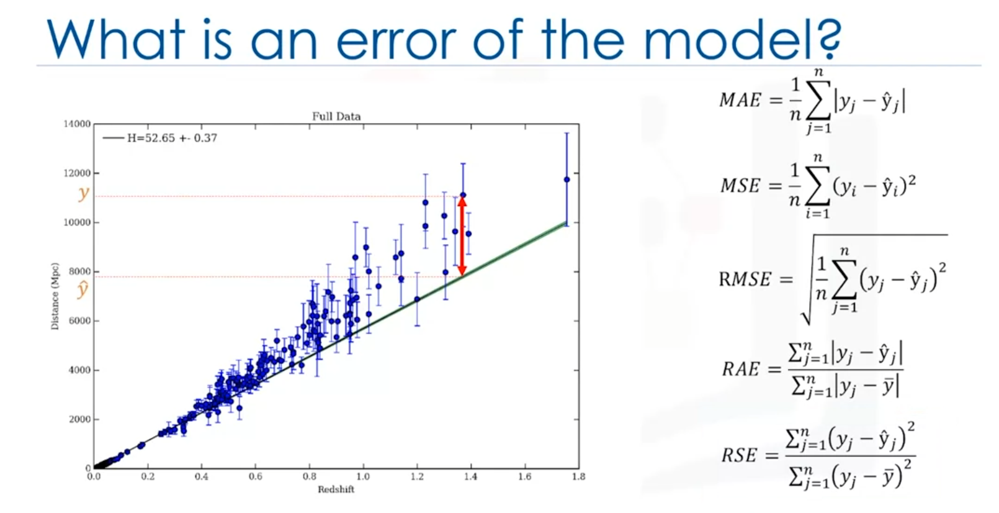

 
# Error in Regression:
  The error in regression is the difference between the data points and the trend line generated by the algorithm.

# Multiple Ways of Errors:

### 1. Mean Absolute Error (MAE):
It is the mean of the absolute value of the errors. This is the easiest of the metrics to understand since it’s just average error.

### 2. Mean Squared Error (MSE):
It is the mean of the squared error. It’s more popular than Mean Absolute Error because the focus is geared more towards large errors. This is due to the squared term exponentially increasing larger errors in comparison to smaller ones.

### 3. Root Mean Squared Error (RMSE):
Square root of MSE. It is popular since it is interpretable in the same units as the response vector or Y units, making it easy to relate its information.

### 4. Relative Absolute Error (RAE):
It takes the total absolute error and normalizes it by dividing by the total absolute error of the simple predictor.

### 5. Relative Squared Error (RSE):
It is similar to RAE but is widely adopted by the data science community as it is used for calculating R-squared.

# Other Important Concepts:

### 1. R-Squared:
It is not an error, but rather a popular metric to measure the performance of your regression model. It represents how close the data points are to the fitted regression line. The higher the R-squared value, the better the model fits your data. The best possible score is 1.0 and it can be negative (because the model can be arbitrarily worse).

### 2. Ordinary Least Squares (OLS)
OLS is a method for estimating the unknown parameters in a linear regression model. OLS chooses the parameters of a linear function of a set of explanatory variables by minimizing the sum of the squares of the differences between the target dependent variable and those predicted by the linear function. In other words, it tries to minimizes the sum of squared errors (SSE) or mean squared error (MSE) between the target variable (y) and our predicted output (y-hat) over all samples in the dataset.

OLS can find the best parameters using of the following methods:

- Solving the model parameters analytically using closed-form equations
- Using an optimization algorithm (Gradient Descent, Stochastic Gradient Descent, Newton’s Method, etc.)
  
