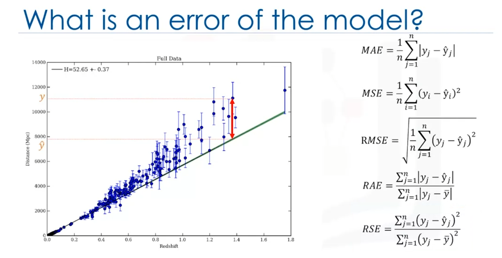

 
# Error in Regression:
  The error in regression is the difference between the data points and the trend line generated by the algorithm.

# Multiple Ways of Errors:

1. Mean Absolute Error (MAE):
Absolute Value of the Errors and is easiest to understand.

2. Mean Squared Error (MSE):
It focuses towards large errors, due to the squared term exponentially increasing larger errors in comparison to smaller ones

3. Root Mean Squared Error (RMSE):
Square root of MSE. It is popular since it is interpretable in the same units as the response vector or Y units, making it easy to relate its information.

4. Relative Absolute Error (RAE):
It takes the total absolute error and normalizes it by dividing by the total absolute error of the simple predictor.

5. Relative Squared Error (RSE):
It is similar to RAE but is widely adopted by the data science community as it is used for calculating R-squared.

# R-Squared:
It is not an error but is a popular metric for the accuracy of your model. It represents how close the data values are to the fitted regression line. The higher the R-squared, the better the model fits your data.
